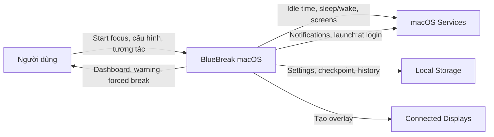
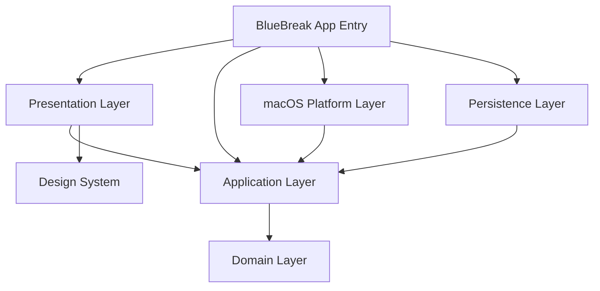
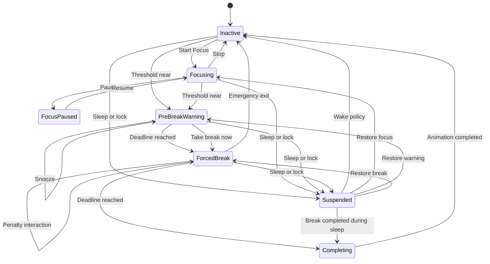
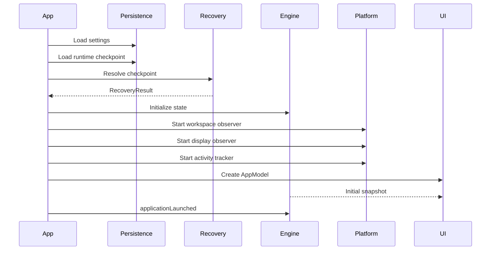
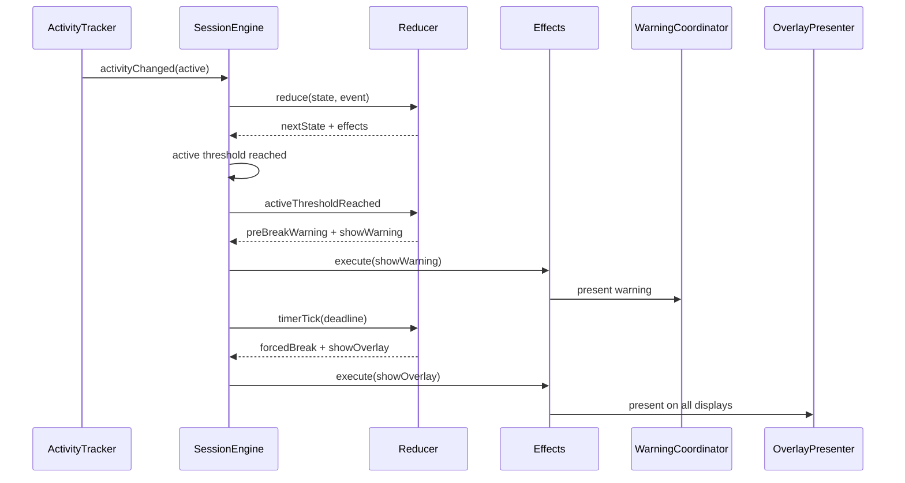
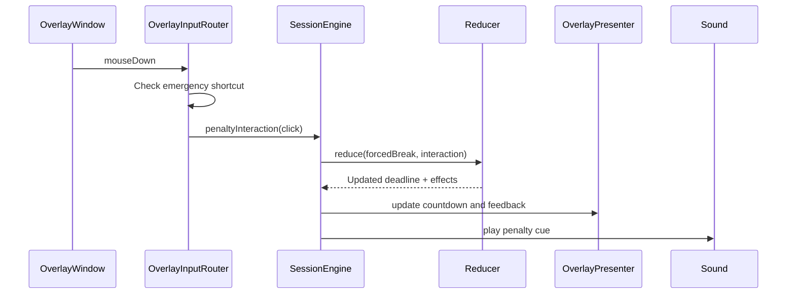
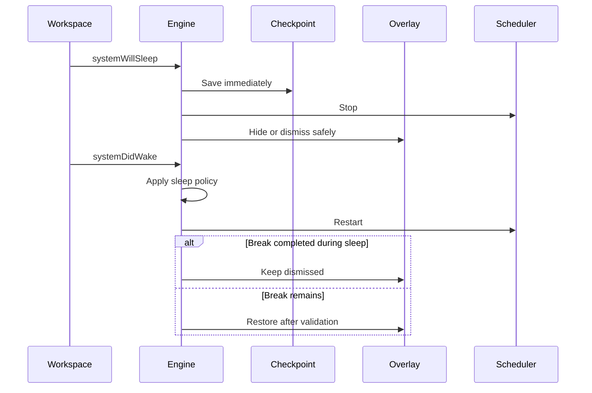

# BLUEBREAK FOR macOS

# SOFTWARE ARCHITECTURE DOCUMENT

**Phiên bản:** 1.0
**Trạng thái:** Proposed Architecture
**Nền tảng:** macOS 14 trở lên
**Kiến trúc:** Native macOS, modular monolith, local-first
**Ngôn ngữ:** Swift
**UI framework:** SwiftUI kết hợp AppKit
**Persistence:** UserDefaults, SwiftData, atomic checkpoint file
**Phân phối dự kiến:** Developer ID, notarized DMG
**Tài liệu liên quan:** BlueBreak Product Requirements Document

---

# 1. Mục đích tài liệu

Tài liệu này mô tả kiến trúc phần mềm cho BlueBreak phiên bản macOS.

Mục tiêu của tài liệu:

* Chuyển các yêu cầu trong PRD thành kiến trúc có thể triển khai.
* Xác định ranh giới giữa domain, application, platform và UI.
* Định nghĩa state machine trung tâm.
* Thiết kế activity tracking.
* Thiết kế forced-break overlay trên nhiều màn hình.
* Xử lý penalty interaction.
* Xử lý sleep, wake, screen lock và crash recovery.
* Định nghĩa persistence model.
* Định nghĩa concurrency model.
* Xác định chiến lược kiểm thử.
* Hạn chế coupling với macOS API.
* Chuẩn bị khả năng triển khai phiên bản Windows trong tương lai.

---

# 2. Bối cảnh hệ thống

BlueBreak là ứng dụng menu bar chạy nền trên macOS.

Ứng dụng có các trách nhiệm chính:

1. Theo dõi thời gian người dùng thực sự hoạt động.
2. Quản lý Pomodoro.
3. Phát hiện khi người dùng đạt ngưỡng nghỉ bắt buộc.
4. Cảnh báo trước khi phiên nghỉ bắt đầu.
5. Hiển thị overlay toàn màn hình trên tất cả display.
6. Ghi nhận thao tác chống đối trong overlay.
7. Cộng penalty vào thời gian nghỉ.
8. Quản lý settings và lịch sử phiên.
9. Khôi phục trạng thái sau sleep, wake hoặc crash.
10. Cung cấp dashboard, menu bar popover và settings.

BlueBreak không có backend trong MVP.

Toàn bộ nghiệp vụ hoạt động offline và dữ liệu được lưu local.

---

# 3. Architectural drivers

Các yếu tố ảnh hưởng lớn nhất đến kiến trúc gồm:

## 3.1. Giao diện và animation chất lượng cao

Ứng dụng cần:

* Animation 60 FPS.
* Chuyển cảnh mượt.
* Hỗ trợ Retina.
* Hỗ trợ nhiều màn hình.
* Hỗ trợ Reduce Motion.
* Hỗ trợ Dark Mode.
* Giao diện có cảm giác native macOS.

Do đó, ứng dụng sử dụng SwiftUI cho phần UI hiện đại và AppKit cho quản lý window cấp thấp.

## 3.2. Tích hợp sâu với macOS

Ứng dụng cần làm việc với:

* Menu bar.
* Spaces.
* Stage Manager.
* Full-screen applications.
* Multi-display.
* Sleep và wake.
* Screen lock.
* Launch at Login.
* Local notifications.

SwiftUI cung cấp `MenuBarExtra` để tạo phần tử menu bar, bao gồm kiểu popover-like window phù hợp với dashboard nhỏ của BlueBreak.

AppKit cung cấp các window collection behavior để cửa sổ xuất hiện trên nhiều Space và tham gia vào không gian full-screen hoặc Stage Manager khi phù hợp.

## 3.3. Timer phải chính xác

Timer không được phụ thuộc vào việc trừ một giây sau mỗi tick.

Tick chỉ dùng để cập nhật giao diện.

Thời gian thực tế phải được tính từ:

* Deadline.
* Timestamp.
* Monotonic clock khi tiến trình đang chạy.
* Checkpoint khi ứng dụng bị đóng hoặc crash.

## 3.4. Quyền riêng tư

BlueBreak không được lưu:

* Nội dung phím.
* Tọa độ click phục vụ analytics.
* Tên ứng dụng đang sử dụng.
* Tên tài liệu.
* Website.
* Screenshot.
* Nội dung clipboard.

Activity tracking chỉ cần biết thời gian kể từ input gần nhất. Core Graphics cung cấp API trả về thời gian kể từ sự kiện input gần nhất mà không yêu cầu ứng dụng lưu nội dung phím hoặc nội dung thao tác.

## 3.5. Khả năng kiểm thử

Nghiệp vụ timer, threshold, warning, penalty và recovery phải kiểm thử được mà không cần:

* Mở cửa sổ thật.
* Chờ thời gian thật.
* Gửi sự kiện chuột thật.
* Đưa máy vào sleep.
* Kết nối màn hình thật.

Do đó, clock, scheduler và platform services phải được inject qua protocol.

---

# 4. Kiến trúc tổng thể

BlueBreak sử dụng kiến trúc:

> **Modular Monolith + Clean Architecture + Unidirectional State Flow**

Ứng dụng được chia thành các layer:

```text
┌─────────────────────────────────────────────┐
│ Presentation                               │
│ SwiftUI Views, View Models, Design System  │
├─────────────────────────────────────────────┤
│ Application                                │
│ Session Engine, Use Cases, Coordinators    │
├─────────────────────────────────────────────┤
│ Domain                                     │
│ Entities, Policies, State Machine          │
├─────────────────────────────────────────────┤
│ Platform and Infrastructure                │
│ AppKit, Core Graphics, SwiftData, OSLog    │
└─────────────────────────────────────────────┘
```

Quy tắc dependency:

```text
Presentation ───────→ Application
Application ────────→ Domain
Infrastructure ─────→ Application abstractions
Platform ───────────→ Application abstractions
Domain ─────────────→ Không phụ thuộc layer nào
```

Domain không được import:

* SwiftUI.
* AppKit.
* CoreGraphics.
* SwiftData.
* UserNotifications.
* ServiceManagement.
* OSLog.

---

# 5. System context



BlueBreak không giao tiếp với dịch vụ cloud trong MVP.

---

# 6. Container architecture



## 6.1. BlueBreak App Entry

Trách nhiệm:

* Khởi tạo dependency container.
* Khởi tạo SwiftData container.
* Khởi tạo application coordinator.
* Khởi tạo menu bar scene.
* Quản lý app lifecycle.
* Khôi phục checkpoint.
* Bắt đầu các platform observer.

## 6.2. Presentation Layer

Trách nhiệm:

* Dashboard.
* Menu bar popover.
* Onboarding.
* Settings.
* Statistics.
* Warning window.
* Forced-break content.
* Binding application snapshot vào UI.
* Animation và accessibility.

Presentation không được trực tiếp:

* Tính thời gian.
* Ghi database.
* Đọc Core Graphics.
* Tạo notification.
* Điều khiển `NSWindow`.
* Thay đổi state machine.

## 6.3. Application Layer

Trách nhiệm:

* Điều phối use case.
* Sở hữu session state.
* Nhận platform event.
* Gọi domain reducer.
* Thực thi effect.
* Tạo snapshot cho UI.
* Lưu checkpoint.
* Quản lý lifecycle của session.

## 6.4. Domain Layer

Trách nhiệm:

* Session state.
* State transition.
* Break policy.
* Penalty policy.
* Snooze policy.
* Reset policy.
* Timer calculation.
* Business invariants.

## 6.5. Platform Layer

Trách nhiệm:

* Activity tracking.
* AppKit windows.
* Display observation.
* Sleep/wake observation.
* Screen lock observation.
* Notifications.
* Launch at Login.
* Sound.
* Haptic-like visual feedback.
* System appearance.

## 6.6. Persistence Layer

Trách nhiệm:

* Settings.
* Session history.
* Runtime checkpoint.
* Data migration.
* Data retention.
* Export và deletion.

---

# 7. Cấu trúc source code

Cấu trúc đề xuất:

```text
BlueBreak/
├── BlueBreak.xcodeproj
│
├── App/
│   └── BlueBreakMac/
│       ├── BlueBreakApp.swift
│       ├── AppDelegate.swift
│       ├── AppCoordinator.swift
│       ├── DependencyContainer.swift
│       └── AppCommands.swift
│
├── Packages/
│   ├── BlueBreakDomain/
│   │   ├── Sources/
│   │   │   ├── Entities/
│   │   │   ├── States/
│   │   │   ├── Events/
│   │   │   ├── Effects/
│   │   │   ├── Policies/
│   │   │   ├── Reducers/
│   │   │   └── ValueObjects/
│   │   └── Tests/
│   │
│   ├── BlueBreakApplication/
│   │   ├── Sources/
│   │   │   ├── SessionEngine/
│   │   │   ├── UseCases/
│   │   │   ├── Ports/
│   │   │   ├── DTOs/
│   │   │   ├── Mappers/
│   │   │   └── Recovery/
│   │   └── Tests/
│   │
│   ├── BlueBreakPlatformMac/
│   │   ├── Sources/
│   │   │   ├── Activity/
│   │   │   ├── Overlay/
│   │   │   ├── Display/
│   │   │   ├── Workspace/
│   │   │   ├── Notifications/
│   │   │   ├── LoginItem/
│   │   │   ├── Audio/
│   │   │   └── Logging/
│   │   └── Tests/
│   │
│   ├── BlueBreakPersistence/
│   │   ├── Sources/
│   │   │   ├── Settings/
│   │   │   ├── SwiftDataModels/
│   │   │   ├── Repositories/
│   │   │   ├── Checkpoint/
│   │   │   └── Migration/
│   │   └── Tests/
│   │
│   ├── BlueBreakDesignSystem/
│   │   ├── Sources/
│   │   │   ├── Tokens/
│   │   │   ├── Components/
│   │   │   ├── Typography/
│   │   │   ├── Motion/
│   │   │   ├── Effects/
│   │   │   └── Accessibility/
│   │   └── Tests/
│   │
│   └── BlueBreakFeatures/
│       ├── Sources/
│       │   ├── Onboarding/
│       │   ├── Dashboard/
│       │   ├── MenuBar/
│       │   ├── Pomodoro/
│       │   ├── Warning/
│       │   ├── ForcedBreak/
│       │   ├── Statistics/
│       │   └── Settings/
│       └── Tests/
│
├── Resources/
│   ├── Assets.xcassets
│   ├── Animations/
│   ├── Audio/
│   ├── Shaders/
│   ├── Localizations/
│   └── TrollMessages/
│
├── UITests/
├── IntegrationTests/
├── Scripts/
├── Config/
└── Docs/
    ├── architecture/
    ├── adr/
    ├── testing/
    └── releases/
```

---

# 8. Module dependency rules

Dependency được giới hạn như sau:

```text
BlueBreakMac
  ├── BlueBreakFeatures
  ├── BlueBreakApplication
  ├── BlueBreakPlatformMac
  └── BlueBreakPersistence

BlueBreakFeatures
  ├── BlueBreakApplication
  └── BlueBreakDesignSystem

BlueBreakApplication
  └── BlueBreakDomain

BlueBreakPlatformMac
  └── BlueBreakApplication

BlueBreakPersistence
  └── BlueBreakApplication

BlueBreakDesignSystem
  └── Không phụ thuộc business module

BlueBreakDomain
  └── Swift Standard Library/Foundation tối thiểu
```

Không cho phép:

```text
Domain → AppKit
Domain → SwiftUI
Application → SwiftData
Feature → SwiftData
Feature → CGEventSource
Feature → NSWindow
Persistence → SwiftUI
Platform → Feature
```

---

# 9. Domain model

## 9.1. Session state

Không sử dụng nhiều boolean độc lập như:

```swift
var isFocusing: Bool
var isPaused: Bool
var isWarningVisible: Bool
var isForcedBreak: Bool
```

Các biến trên có thể tạo trạng thái không hợp lệ, ví dụ vừa `isPaused` vừa `isForcedBreak`.

Thay vào đó sử dụng một enum có associated value:

```swift
public enum SessionState: Equatable, Sendable {
    case inactive(InactiveContext)
    case focusing(FocusContext)
    case focusPaused(PausedFocusContext)
    case preBreakWarning(WarningContext)
    case forcedBreak(ForcedBreakContext)
    case completing(CompletionContext)
    case suspended(SuspendedContext)
}
```

## 9.2. InactiveContext

```swift
public struct InactiveContext: Equatable, Sendable {
    public let activeCycle: ActiveCycle
    public let lastCompletedBreakAt: Date?
}
```

## 9.3. FocusContext

```swift
public struct FocusContext: Equatable, Sendable {
    public let sessionID: SessionID
    public let startedAt: Date
    public let plannedDuration: Duration
    public let deadline: Date
    public let pausedDuration: Duration
    public let activeCycle: ActiveCycle
}
```

## 9.4. WarningContext

```swift
public struct WarningContext: Equatable, Sendable {
    public let warningID: WarningID
    public let thresholdReachedAt: Date
    public let forcedBreakStartsAt: Date
    public let snoozeCount: Int
    public let activeCycle: ActiveCycle
}
```

## 9.5. ForcedBreakContext

```swift
public struct ForcedBreakContext: Equatable, Sendable {
    public let sessionID: SessionID
    public let startedAt: Date
    public let baseDuration: Duration
    public let baseDeadline: Date
    public let penaltyDuration: Duration
    public let penaltyCount: Int
    public let emergencyExitAvailable: Bool

    public var effectiveDeadline: Date {
        baseDeadline.addingTimeInterval(penaltyDuration.timeInterval)
    }
}
```

## 9.6. ActiveCycle

```swift
public struct ActiveCycle: Equatable, Sendable {
    public let cycleID: UUID
    public let startedAt: Date
    public let accumulatedActiveDuration: Duration
    public let currentSegmentStartedAt: Date?
    public let lastActivityObservedAt: Date?
}
```

`ActiveCycle` đại diện cho khoảng thời gian từ lần reset gần nhất đến forced break tiếp theo.

---

# 10. Value objects

Không truyền số nguyên không có đơn vị xuyên suốt hệ thống.

Sử dụng value object rõ nghĩa:

```swift
public struct FocusDuration: Equatable, Sendable
public struct BreakDuration: Equatable, Sendable
public struct ActiveTimeThreshold: Equatable, Sendable
public struct IdleThreshold: Equatable, Sendable
public struct PenaltyDuration: Equatable, Sendable
public struct PenaltyLimit: Equatable, Sendable
public struct SnoozeLimit: Equatable, Sendable
```

Các value object chịu trách nhiệm validation.

Ví dụ:

```swift
public struct ActiveTimeThreshold: Equatable, Sendable {
    public let duration: Duration

    public init(duration: Duration) throws {
        guard duration >= .minutes(20),
              duration <= .hours(8) else {
            throw ValidationError.invalidActiveThreshold
        }

        self.duration = duration
    }
}
```

Không cho phép UI truyền một giá trị chưa validate vào state machine.

---

# 11. Policies

Business rule được đóng gói thành policy.

## 11.1. BreakPolicy

```swift
public struct BreakPolicy: Equatable, Sendable {
    public let mandatoryBreakEnabled: Bool
    public let activeThreshold: Duration
    public let forcedBreakDuration: Duration
    public let idleThreshold: Duration
    public let resetPolicy: ActiveCycleResetPolicy
}
```

## 11.2. PenaltyPolicy

```swift
public struct PenaltyPolicy: Equatable, Sendable {
    public let enabledInteractions: Set<PenaltyInteractionType>
    public let durationPerInteraction: Duration
    public let maximumPenalty: Duration
    public let debounceInterval: Duration
}
```

## 11.3. WarningPolicy

```swift
public struct WarningPolicy: Equatable, Sendable {
    public let milestones: [Duration]
    public let snoozeDuration: Duration
    public let maximumSnoozeCount: Int
    public let maximumTotalSnooze: Duration
}
```

## 11.4. SleepPolicy

```swift
public enum SleepBreakPolicy: Equatable, Sendable {
    case countSleepAsBreak
    case pauseBreakDuringSleep
    case completeIfSleepExceedsRemainingTime
}
```

## 11.5. EmergencyExitPolicy

```swift
public struct EmergencyExitPolicy: Equatable, Sendable {
    public let shortcut: KeyboardShortcutDefinition
    public let holdDuration: Duration
    public let cooldown: Duration
    public let resetsActiveCycle: Bool
}
```

---

# 12. Session events

Mọi thay đổi nghiệp vụ phải đi qua `SessionEvent`.

```swift
public enum SessionEvent: Equatable, Sendable {
    case applicationLaunched(RecoveryContext?)
    case timerTick(Instant)
    case activityChanged(ActivityStatus, Instant)

    case startFocus(FocusRequest)
    case pauseFocus
    case resumeFocus
    case stopFocus
    case skipFocus

    case activeThresholdReached
    case warningMilestoneReached(Duration)
    case takeBreakNow
    case snoozeRequested
    case warningDismissed

    case forcedBreakStarted
    case penaltyInteraction(PenaltyInteraction)
    case emergencyExitRequested

    case forcedBreakDeadlineReached
    case completionAnimationFinished

    case systemWillSleep(Instant)
    case systemDidWake(WakeContext)
    case sessionLocked
    case sessionUnlocked
    case screenConfigurationChanged

    case overlayCreationFailed(DisplayID)
    case persistenceFailed(PersistenceOperation)
    case applicationWillTerminate
}
```

View không được trực tiếp sửa state.

Ví dụ, view gửi:

```swift
sessionEngine.send(.pauseFocus)
```

Thay vì:

```swift
viewModel.isPaused = true
```

---

# 13. Domain reducer

State machine được triển khai bằng pure reducer:

```swift
public protocol SessionReducing: Sendable {
    func reduce(
        state: SessionState,
        event: SessionEvent,
        environment: DomainEnvironment
    ) -> Transition
}
```

Kết quả:

```swift
public struct Transition: Equatable, Sendable {
    public let previousState: SessionState
    public let nextState: SessionState
    public let effects: [SessionEffect]
}
```

Ví dụ effect:

```swift
public enum SessionEffect: Equatable, Sendable {
    case showPreBreakWarning
    case dismissPreBreakWarning
    case scheduleNotification(NotificationRequest)
    case showForcedBreakOverlay
    case updateForcedBreakOverlay
    case closeForcedBreakOverlay
    case playSound(SoundCue)
    case presentPenaltyFeedback(PenaltyFeedback)
    case persistCheckpoint
    case recordSession(SessionRecord)
    case resetActiveCycle
    case updateMenuBar
    case reportRecoverableError(AppError)
}
```

Reducer:

* Không gọi database.
* Không gọi AppKit.
* Không phát âm thanh.
* Không tạo notification.
* Không tạo `Task`.
* Không đọc thời gian hệ thống trực tiếp.

Reducer chỉ nhận dữ liệu và trả về transition.

---

# 14. State transition overview



---

# 15. Application layer

## 15.1. SessionEngine

`SessionEngine` là nguồn sự thật duy nhất của runtime session.

```swift
public actor SessionEngine {
    private var state: SessionState
    private let reducer: SessionReducing
    private let effectExecutor: SessionEffectExecuting
    private let checkpointStore: RuntimeCheckpointStore
    private let clock: AppClock

    public func send(_ event: SessionEvent) async
    public func snapshots() -> AsyncStream<SessionSnapshot>
}
```

Trách nhiệm:

1. Nhận event.
2. Gọi reducer.
3. Cập nhật state.
4. Lưu checkpoint khi cần.
5. Phát snapshot cho UI.
6. Gửi effect sang effect executor.
7. Ghi log transition.

`SessionEngine` là actor để đảm bảo các event được xử lý tuần tự.

Không sử dụng lock thủ công nếu không cần thiết.

## 15.2. SessionSnapshot

UI không nhận trực tiếp domain state phức tạp.

Application layer chuyển state thành read model:

```swift
public struct SessionSnapshot: Equatable, Sendable {
    public let mode: SessionMode
    public let primaryTimeRemaining: Duration?
    public let activeTime: Duration
    public let timeUntilMandatoryBreak: Duration?
    public let penaltyCount: Int
    public let penaltyDuration: Duration
    public let snoozeCount: Int
    public let canPause: Bool
    public let canResume: Bool
    public let canStop: Bool
    public let canSnooze: Bool
    public let overlayPresentation: OverlayPresentation?
}
```

Snapshot chỉ chứa dữ liệu cần để render.

## 15.3. AppModel

`AppModel` nằm trên `MainActor` và bridge snapshot sang SwiftUI.

```swift
@MainActor
@Observable
final class AppModel {
    private(set) var session: SessionSnapshot
    private(set) var settings: SettingsSnapshot
    private(set) var statistics: DailyStatisticsSnapshot

    func startFocus()
    func pauseFocus()
    func resumeFocus()
    func stopFocus()
    func takeBreakNow()
    func snooze()
    func emergencyExit()
}
```

`AppModel` không chứa business rule.

---

# 16. Effect execution

Effect được thực thi qua một executor:

```swift
public protocol SessionEffectExecuting: Sendable {
    func execute(_ effect: SessionEffect) async
}
```

Implementation:

```swift
public actor DefaultSessionEffectExecutor {
    private let overlayPresenter: OverlayPresenting
    private let notificationService: NotificationServicing
    private let soundService: SoundServicing
    private let sessionRepository: SessionRepository
    private let checkpointStore: RuntimeCheckpointStore
}
```

Các effect liên quan đến AppKit phải được chuyển sang `MainActor`.

Ví dụ:

```swift
case .showForcedBreakOverlay:
    await overlayPresenter.present()
```

Không thực thi AppKit operation bên trong domain actor.

---

# 17. Clock architecture

Timer cần hai loại clock.

## 17.1. Runtime monotonic clock

Dùng cho:

* Đo elapsed time khi ứng dụng đang chạy.
* Debounce penalty.
* Emergency shortcut hold.
* Animation timing.
* Scheduler.

Clock này không bị ảnh hưởng bởi việc người dùng chỉnh giờ hệ thống trong khi ứng dụng đang chạy.

## 17.2. Wall clock

Dùng cho:

* Lưu `startedAt`.
* Lưu `endedAt`.
* Hiển thị lịch sử.
* Khôi phục sau khi ứng dụng khởi động lại.
* Daily statistics.

Abstraction:

```swift
public protocol AppClock: Sendable {
    func now() -> Date
    func monotonicNow() -> ContinuousClock.Instant
    func sleep(for duration: Duration) async throws
}
```

Test sử dụng `TestClock`.

## 17.3. Deadline-based calculation

Không triển khai:

```swift
remainingSeconds -= 1
```

Triển khai:

```swift
remaining = max(.zero, deadline - clock.now())
```

UI tick chỉ yêu cầu snapshot mới.

Nếu một tick bị trễ ba giây, timer tiếp theo vẫn chính xác.

---

# 18. Scheduler

Ứng dụng sử dụng một scheduler nghiệp vụ duy nhất.

```swift
public actor SessionScheduler {
    private let sessionEngine: SessionEngine
    private let clock: AppClock

    public func start() async
    public func stop()
}
```

Cadence đề xuất:

* Khi focus hoặc break đang chạy: 1 giây.
* Khi warning dưới một phút: 1 giây.
* Khi chỉ theo dõi active threshold: 2–5 giây.
* Khi người dùng idle lâu: 5–10 giây.
* Khi suspended: dừng scheduler.

Animation 60 FPS không chạy qua scheduler nghiệp vụ.

Animation do SwiftUI, Core Animation hoặc Metal quản lý độc lập.

---

# 19. Activity tracking architecture

## 19.1. ActivityTracker port

```swift
public protocol ActivityTracking: Sendable {
    func activityEvents() -> AsyncStream<ActivityObservation>
    func currentObservation() async -> ActivityObservation
}
```

```swift
public struct ActivityObservation: Equatable, Sendable {
    public let observedAt: Date
    public let idleDuration: Duration
    public let status: ActivityStatus
}
```

```swift
public enum ActivityStatus: Equatable, Sendable {
    case active
    case idle
    case locked
    case sleeping
    case unavailable
}
```

## 19.2. MacActivityTracker

Implementation sử dụng thời gian kể từ input gần nhất.

```text
CGEventSource
    ↓
Idle duration
    ↓
So sánh với IdleThreshold
    ↓
ActivityObservation
    ↓
SessionEngine
```

Không tạo global key logger.

Không lưu event cụ thể.

Không lưu key code.

Không lưu vị trí con trỏ.

## 19.3. Active time accumulation

Giả sử:

* Idle threshold là 5 phút.
* Người dùng ngừng thao tác lúc 10:00.
* Lần quan sát tiếp theo diễn ra lúc 10:07.

Hệ thống có thể tính active segment kết thúc tại:

```text
10:00 + 5 phút = 10:05
```

Thời gian từ 10:05 đến 10:07 được xem là idle.

Thuật toán:

```swift
if observation.status == .active {
    continueCurrentActiveSegment()
}

if observation.status == .idle {
    closeActiveSegment(
        at: observation.observedAt - observation.idleDuration + idleThreshold
    )
}
```

Mọi thời lượng phải được clamp để không âm và không vượt thời gian thực đã trôi qua.

## 19.4. Permission strategy

MVP ưu tiên API không yêu cầu Accessibility hoặc Input Monitoring.

Nếu một tính năng tương lai cần global event tap:

* Phải có onboarding riêng.
* Phải giải thích quyền.
* Tính năng phải bị tắt mặc định.
* Ứng dụng vẫn hoạt động cơ bản khi người dùng từ chối quyền.

---

# 20. Overlay architecture

## 20.1. Thành phần

```text
OverlaySessionController
├── DisplayObserver
├── OverlayWindowFactory
├── OverlayWindowRegistry
├── OverlayInputRouter
├── OverlayContentModel
└── OverlayAnimationController
```

## 20.2. OverlaySessionController

```swift
@MainActor
public protocol OverlayPresenting {
    func present(_ presentation: OverlayPresentation) async throws
    func update(_ presentation: OverlayPresentation)
    func dismiss(reason: OverlayDismissReason) async
}
```

Trách nhiệm:

* Tạo một window cho mỗi display.
* Đồng bộ nội dung.
* Chọn primary overlay.
* Xử lý display connect/disconnect.
* Đóng toàn bộ overlay.
* Báo lỗi nếu một display không tạo được overlay.

## 20.3. Một window cho mỗi display

Không tạo một window lớn trải qua toàn bộ virtual desktop.

Thiết kế:

```text
Display A → OverlayWindow A
Display B → OverlayWindow B
Display C → OverlayWindow C
```

Lợi ích:

* Xử lý scale độc lập.
* Hỗ trợ rotation.
* Dễ thêm hoặc gỡ display.
* Không phụ thuộc layout của virtual desktop.
* Dễ giảm animation trên display phụ.
* Input được xác định theo window.

## 20.4. OverlayWindow

Có thể triển khai bằng subclass của `NSPanel` hoặc `NSWindow`.

Yêu cầu:

* Borderless.
* Transparent title bar.
* Không có shadow hệ thống nếu không cần.
* Bao phủ frame của display.
* Không xuất hiện trong danh sách window thông thường.
* Không tham gia Exposé như cửa sổ tài liệu.
* Có khả năng nhận pointer event.
* Primary overlay có thể nhận keyboard event.
* Không cố bao phủ lock screen hoặc security surfaces.

Window collection behavior được đóng gói trong:

```swift
struct OverlayWindowPolicy {
    let collectionBehavior: NSWindow.CollectionBehavior
    let level: NSWindow.Level
    let canBecomeKey: Bool
    let canBecomeMain: Bool
}
```

Không rải các giá trị window level trong code.

Mặc định sử dụng behavior phù hợp cho:

* All Spaces.
* Full-screen auxiliary behavior.
* Stage Manager.
* Transient overlay.

Việc kết hợp behavior phải được kiểm thử theo từng phiên bản macOS do một số behavior có tính loại trừ lẫn nhau. Apple mô tả `canJoinAllApplications` dành cho floating windows và system overlays, đồng thời lưu ý không kết hợp nó với các behavior primary hoặc auxiliary loại trừ tương ứng.

## 20.5. SwiftUI content trong AppKit window

Mỗi overlay window chứa:

```text
NSWindow hoặc NSPanel
    ↓
OverlayEventCaptureView
    ↓
NSHostingView
    ↓
ForcedBreakView
```

`ForcedBreakView` là SwiftUI.

`OverlayEventCaptureView` là AppKit view chịu trách nhiệm nhận input.

## 20.6. Primary overlay

Chỉ một overlay được chọn làm primary.

Primary overlay:

* Nhận keyboard focus.
* Xử lý emergency shortcut.
* Phát accessibility announcements.
* Có thể hiển thị toàn bộ diagnostic content.

Secondary overlay:

* Hiển thị countdown đồng bộ.
* Nhận pointer click cục bộ.
* Không tranh keyboard focus.
* Có thể sử dụng animation nhẹ hơn.

Primary display được chọn theo thứ tự:

1. Display chứa con trỏ tại thời điểm break bắt đầu.
2. Main display.
3. Display đầu tiên còn khả dụng.

---

# 21. Display observation

```swift
public protocol DisplayObserving: Sendable {
    func displayEvents() -> AsyncStream<DisplayEvent>
    func currentDisplays() async -> [DisplayDescriptor]
}
```

```swift
public struct DisplayDescriptor: Hashable, Sendable {
    public let id: DisplayID
    public let frame: DisplayFrame
    public let scaleFactor: Double
    public let isMain: Bool
    public let isBuiltIn: Bool
}
```

Các event:

```swift
public enum DisplayEvent: Sendable {
    case connected(DisplayDescriptor)
    case disconnected(DisplayID)
    case configurationChanged([DisplayDescriptor])
}
```

Khi forced break đang chạy:

* Display mới phải có overlay trong vòng một giây.
* Display bị tháo phải giải phóng window.
* Countdown không được reset.
* Primary overlay phải được chọn lại nếu display primary biến mất.

---

# 22. Overlay input architecture

## 22.1. Input normalization

AppKit event được chuyển thành domain event đơn giản:

```swift
public struct PenaltyInteraction: Equatable, Sendable {
    public let type: PenaltyInteractionType
    public let occurredAt: ContinuousClock.Instant
    public let displayID: DisplayID
}
```

```swift
public enum PenaltyInteractionType: Equatable, Hashable, Sendable {
    case primaryClick
    case secondaryClick
    case trackpadTap
    case scroll
    case keyPress
    case gesture
}
```

Không đưa `NSEvent` vào domain.

## 22.2. Event priority

Input phải được xử lý theo thứ tự:

```text
1. Emergency shortcut
2. Accessibility navigation
3. Allowed overlay control
4. Penalty interaction
5. Ignore
```

Emergency shortcut không được tạo penalty.

## 22.3. Debounce

Debounce được thực hiện trong domain hoặc application engine, không phụ thuộc UI.

```swift
public struct PenaltyDebounceState: Equatable, Sendable {
    public let lastAcceptedAtByType:
        [PenaltyInteractionType: ContinuousClock.Instant]
}
```

Quy tắc mặc định:

* Click: 500 ms.
* Scroll: một penalty cho mỗi gesture hoặc mỗi khoảng giới hạn.
* Key press: tắt mặc định.
* Key hold: không lặp penalty theo key repeat.
* Maximum penalty luôn được kiểm tra cuối cùng.

## 22.4. Penalty calculation

```swift
let remainingCapacity =
    policy.maximumPenalty - context.penaltyDuration

let acceptedPenalty =
    min(policy.durationPerInteraction, remainingCapacity)
```

Invariant:

```text
0 ≤ penaltyDuration ≤ maximumPenalty
```

Nếu penalty đã đạt maximum:

* Không thay đổi deadline.
* Có thể hiển thị feedback khác.
* Không ghi nhận penalty duration mới.
* Có thể vẫn ghi nhận một capped interaction riêng cho diagnostics local.

---

# 23. Emergency exit architecture

Emergency exit sử dụng một detector riêng:

```swift
@MainActor
final class EmergencyShortcutDetector {
    func keyDown(_ event: NSEvent)
    func keyUp(_ event: NSEvent)
    func cancel()
}
```

Luồng:

```text
Shortcut bắt đầu được giữ
    ↓
Start monotonic hold timer
    ↓
Hiển thị progress nhỏ
    ↓
Giữ đủ thời lượng?
    ├── Không → Cancel
    └── Có → EmergencyExitRequested
```

Không dùng một delay không thể hủy.

Khi một phím trong shortcut được thả:

* Hủy detector.
* Reset progress.
* Không tạo emergency event.
* Không tính penalty đối với chuỗi thao tác đó.

Emergency exit luôn phải hoạt động ngay cả khi:

* Sound bị lỗi.
* Persistence bị lỗi.
* Animation bị lỗi.
* Secondary display bị lỗi.
* Network không tồn tại.

---

# 24. Warning architecture

Warning có ba presentation channel:

```text
WarningCoordinator
├── LocalNotificationChannel
├── FloatingWarningWindowChannel
└── MenuBarWarningChannel
```

Application quyết định nội dung và thời điểm.

Platform quyết định cách hiển thị.

## 24.1. Notification service

```swift
public protocol NotificationServicing: Sendable {
    func authorizationStatus() async -> NotificationAuthorizationStatus
    func requestAuthorization() async throws -> Bool
    func schedule(_ request: AppNotificationRequest) async throws
    func cancel(ids: [NotificationID]) async
}
```

Ứng dụng phải yêu cầu quyền trước khi lập lịch local notification có alert hoặc sound.

Nếu quyền bị từ chối:

* Floating warning vẫn hoạt động.
* Menu bar warning vẫn hoạt động.
* Settings hiển thị trạng thái.
* Không lặp lại permission prompt liên tục.

## 24.2. Floating warning window

Floating warning không dùng cùng window với forced-break overlay.

Nó có:

* Window level thấp hơn overlay.
* Không chiếm focus theo mặc định.
* Có nút Take Break Now.
* Có nút Snooze.
* Có nút Dismiss.
* Có countdown.

---

# 25. Sleep, wake và session lifecycle

## 25.1. WorkspaceObserver

```swift
public protocol WorkspaceObserving: Sendable {
    func events() -> AsyncStream<WorkspaceEvent>
}
```

```swift
public enum WorkspaceEvent: Sendable {
    case willSleep(Date)
    case didWake(Date)
    case sessionDidResignActive(Date)
    case sessionDidBecomeActive(Date)
    case screensDidSleep(Date)
    case screensDidWake(Date)
}
```

AppKit cung cấp workspace notification cho các sự kiện như will sleep, did wake và session resign active.

## 25.2. Trước khi sleep

Khi nhận `willSleep`:

1. Gửi event vào `SessionEngine`.
2. Lưu checkpoint ngay lập tức.
3. Dừng activity polling.
4. Dừng scheduler nghiệp vụ.
5. Dừng animation nặng.
6. Đóng hoặc ẩn overlay theo policy.
7. Flush session log cần thiết.

## 25.3. Khi wake

Khi nhận `didWake`:

1. Đọc thời điểm wake.
2. Tính thời gian sleep.
3. Áp dụng `SleepBreakPolicy`.
4. Re-enumerate display.
5. Khôi phục scheduler.
6. Khôi phục activity tracking.
7. Render state mới.

## 25.4. Screen lock

Khi session không còn active:

* Không hiển thị overlay trên lock screen.
* Không nhận penalty.
* Không tính active time.
* Lưu checkpoint.
* Chuyển sang suspended context.

Khi session active trở lại:

* Áp dụng recovery policy.
* Không hiển thị overlay trong cùng frame trước khi state được xác định.
* Cho phép một khoảng grace period ngắn để tránh flash UI.

---

# 26. Launch at Login

Port:

```swift
public protocol LoginItemServicing: Sendable {
    func status() async -> LoginItemStatus
    func enable() async throws
    func disable() async throws
}
```

macOS 13 trở lên cung cấp `SMAppService` để quản lý login item và `mainApp` để cấu hình ứng dụng chính khởi chạy khi đăng nhập. Việc đăng ký vẫn phụ thuộc phê duyệt của người dùng.

Không gọi đăng ký tự động nếu người dùng chưa đồng ý.

Error mapping:

```swift
public enum LoginItemError: Error {
    case authorizationRequired
    case registrationFailed
    case deregistrationFailed
    case unsupported
    case unknown
}
```

---

# 27. Persistence architecture

BlueBreak sử dụng ba loại persistence khác nhau.

```text
Settings       → UserDefaults
Session history → SwiftData
Runtime state   → Atomic checkpoint file
```

Không dùng một công nghệ cho mọi loại dữ liệu.

---

# 28. Settings persistence

## 28.1. SettingsRepository

```swift
public protocol SettingsRepository: Sendable {
    func load() async throws -> AppSettings
    func save(_ settings: AppSettings) async throws
    func observe() -> AsyncStream<AppSettings>
    func reset() async throws
}
```

## 28.2. Versioned envelope

```swift
struct SettingsEnvelope: Codable {
    let schemaVersion: Int
    let updatedAt: Date
    let settings: AppSettingsDTO
}
```

Không nên lưu hàng chục key không có migration strategy.

Có thể lưu một số UI preference riêng biệt, nhưng business settings phải được đọc thành một snapshot nhất quán.

## 28.3. Save strategy

* Validate trước khi save.
* Encode ở background actor.
* Write atomically.
* Publish settings mới sau khi write thành công.
* Không để UI và engine sử dụng hai version settings khác nhau.

---

# 29. Session history với SwiftData

SwiftData được sử dụng cho session history vì hỗ trợ model container và migration schema cho dữ liệu persistent.

## 29.1. SessionEntity

```swift
@Model
final class SessionEntity {
    @Attribute(.unique)
    var id: UUID

    var typeRawValue: String
    var startedAt: Date
    var endedAt: Date?
    var plannedDurationSeconds: Double
    var actualDurationSeconds: Double
    var activeDurationSeconds: Double
    var penaltyCount: Int
    var penaltyDurationSeconds: Double
    var snoozeCount: Int
    var completionStatusRawValue: String
    var themeID: String
    var emergencyExitUsed: Bool
    var createdAt: Date
    var schemaVersion: Int
}
```

Không để SwiftData entity đi lên Presentation hoặc Domain.

Repository map:

```text
SessionEntity ⇄ SessionRecord
```

## 29.2. Repository

```swift
public protocol SessionRepository: Sendable {
    func insert(_ record: SessionRecord) async throws
    func update(_ record: SessionRecord) async throws
    func fetch(_ query: SessionQuery) async throws -> [SessionRecord]
    func delete(before date: Date) async throws
    func deleteAll() async throws
}
```

## 29.3. Statistics

MVP ưu tiên tính daily statistics từ session records.

Chưa cần lưu aggregate table nếu lượng dữ liệu nhỏ.

Khi performance trở thành vấn đề, bổ sung `DailyAggregateEntity`.

---

# 30. Runtime checkpoint

SwiftData không nên được cập nhật mỗi giây chỉ để lưu timer.

Runtime state được lưu thành một file checkpoint nhỏ.

Vị trí:

```text
Application Support/
└── BlueBreak/
    └── runtime-checkpoint.json
```

Schema:

```swift
struct RuntimeCheckpoint: Codable {
    let schemaVersion: Int
    let createdAt: Date
    let appVersion: String
    let state: PersistedSessionState
    let activeCycle: PersistedActiveCycle
    let settingsRevision: String
}
```

## Save checkpoint khi:

* Session state thay đổi.
* Focus bắt đầu, pause, resume hoặc stop.
* Warning bắt đầu hoặc snooze.
* Forced break bắt đầu.
* Penalty được chấp nhận.
* Mỗi 15–30 giây khi session đang chạy.
* Trước sleep.
* Trước app termination.
* Display change quan trọng trong forced break.

## Atomic write

Quy trình:

1. Encode vào temporary file.
2. Flush dữ liệu.
3. Replace checkpoint hiện tại atomically.
4. Giữ một backup gần nhất nếu cần.
5. Không ghi trực tiếp đè file đang đọc.

---

# 31. Crash recovery

## 31.1. RecoveryCoordinator

```swift
public protocol SessionRecovering: Sendable {
    func recover(
        checkpoint: RuntimeCheckpoint?,
        now: Date,
        policy: RecoveryPolicy
    ) -> RecoveryResult
}
```

## 31.2. Kết quả recovery

```swift
public enum RecoveryResult: Sendable {
    case startFresh
    case restore(SessionState)
    case completeInterruptedBreak(SessionRecord)
    case requireUserDecision(RecoveryPrompt)
    case discardCorruptedCheckpoint
}
```

## 31.3. Recovery rules

### Focus session

* Tính remaining từ persisted deadline.
* Nếu deadline chưa qua: cho phép restore.
* Nếu deadline đã qua: hoàn thành focus và xác định break tiếp theo.
* Không cộng active time mù quáng cho toàn bộ thời gian app không chạy.

### Pre-break warning

* Nếu forced-break deadline chưa qua: restore warning.
* Nếu deadline đã qua: không lập tức che màn hình trong frame khởi động đầu tiên.
* Hiển thị recovery prompt hoặc bắt đầu break sau grace period theo policy.

### Forced break

Mặc định:

* Không tạo overlay trước khi app hoàn tất launch.
* Validate checkpoint.
* Đánh giá thời gian app không chạy có được xem là break hay không.
* Nếu phiên đã hoàn thành: ghi completed/interrupted record.
* Nếu còn thời gian: hiển thị Resume Break hoặc bắt đầu lại theo policy.

### Corrupted checkpoint

* Đổi tên file thành diagnostic backup.
* Khởi động fresh state.
* Không crash app.
* Không tạo overlay.
* Ghi log lỗi.

---

# 32. Settings update consistency

Một số settings không được áp dụng ngay giữa session.

## Áp dụng ngay

* Sound volume.
* Reduce Motion.
* Glitch intensity.
* Language.
* Warning presentation.
* Theme visual.

## Áp dụng từ session tiếp theo

* Forced break base duration.
* Penalty per interaction.
* Maximum penalty.
* Snooze limit.
* Mandatory threshold nếu thay đổi làm state hiện tại không rõ ràng.

Settings engine cần tạo:

```swift
public enum SettingsApplicationMode {
    case immediate
    case nextSession
    case requiresStateRecalculation
}
```

Khi người dùng thay đổi threshold xuống dưới active time hiện tại:

* Không bật overlay bất ngờ ngay lập tức trong Settings.
* Hiển thị cảnh báo.
* Cho phép áp dụng từ chu kỳ tiếp theo hoặc bắt đầu break có chủ đích.

---

# 33. Menu bar architecture

```swift
@main
struct BlueBreakApp: App {
    var body: some Scene {
        MenuBarExtra {
            MenuBarContentView()
        } label: {
            MenuBarLabelView()
        }
        .menuBarExtraStyle(.window)

        Settings {
            SettingsRootView()
        }
    }
}
```

Code trên chỉ thể hiện composition; production code lấy dependency từ app container.

Menu bar icon state:

```swift
enum MenuBarVisualState {
    case inactive
    case focusing(progress: Double)
    case warning(remaining: Duration)
    case forcedBreak
    case paused
    case error
}
```

Menu bar icon không render animation nặng.

Chỉ cập nhật khi:

* Giây hiển thị thay đổi.
* State thay đổi.
* Progress bucket thay đổi.

---

# 34. Dashboard presentation architecture

Mỗi feature sử dụng cấu trúc:

```text
Feature/
├── View/
├── ViewModel/
├── Models/
├── Components/
├── Preview/
└── Tests/
```

Ví dụ Dashboard:

```text
Dashboard/
├── DashboardView.swift
├── DashboardViewModel.swift
├── DashboardPresentation.swift
├── TimerOrbView.swift
├── DashboardControls.swift
├── DailySummaryView.swift
└── DashboardViewModelTests.swift
```

ViewModel nhận `SessionSnapshot`, không gọi platform services.

```swift
@MainActor
@Observable
final class DashboardViewModel {
    private let commands: SessionCommanding

    var presentation: DashboardPresentation

    func startTapped()
    func pauseTapped()
    func stopTapped()
}
```

---

# 35. Design system architecture

## 35.1. Design tokens

```swift
enum BlueBreakSpacing {
    static let xSmall: CGFloat = 4
    static let small: CGFloat = 8
    static let medium: CGFloat = 16
    static let large: CGFloat = 24
    static let xLarge: CGFloat = 32
}
```

Các token chính:

* Color.
* Typography.
* Spacing.
* Corner radius.
* Shadows.
* Blur.
* Motion duration.
* Spring parameters.
* Overlay effect intensity.
* Accessibility variants.

## 35.2. Motion tokens

```swift
struct MotionToken {
    let duration: Duration
    let curve: MotionCurve
    let reducedMotionFallback: ReducedMotionBehavior
}
```

Không hard-code animation duration trong từng view.

## 35.3. Theme protocol

```swift
public protocol BreakTheme {
    var id: ThemeID { get }
    var palette: BreakThemePalette { get }
    var typography: BreakThemeTypography { get }
    var effects: BreakThemeEffects { get }
    var messageStyle: TrollMessageStyle { get }
}
```

Theme thay đổi visual, không thay đổi business rule.

---

# 36. Animation architecture

Animation chia thành ba tầng.

## Tầng 1: SwiftUI animation

Dùng cho:

* Button.
* Timer number transition.
* Layout.
* Sheet.
* Settings.
* Popover.
* Warning pill.

## Tầng 2: Core Animation

Dùng cho:

* Overlay entrance.
* Layer-based particles.
* Glow.
* Blur.
* Mask.
* Efficient continuous background.

## Tầng 3: Metal shader

Dùng có giới hạn cho:

* Glitch.
* RGB separation.
* Noise displacement.
* Screen tear.
* Distortion.

Metal effect không được chứa business timing.

`ForcedBreakContext` cung cấp dữ liệu; presentation tự render.

## Reduced Motion

Khi Reduce Motion bật:

* Tắt glitch displacement.
* Tắt screen shake.
* Tắt particle explosion.
* Thay scene transition bằng fade.
* Giữ countdown rõ ràng.
* Không thay đổi nghiệp vụ penalty.

---

# 37. Troll message architecture

Message được lưu trong resource JSON:

```json
{
  "schemaVersion": 1,
  "locale": "en",
  "messages": [
    {
      "id": "penalty.nice_try",
      "event": "penalty",
      "intensity": "gentle",
      "text": "Nice try."
    }
  ]
}
```

Service:

```swift
public protocol TrollMessageProviding: Sendable {
    func message(
        for event: TrollEvent,
        intensity: TrollIntensity,
        locale: Locale
    ) async -> TrollMessage
}
```

Yêu cầu:

* Có fallback English.
* Không lặp cùng message liên tiếp.
* Không chứa nội dung xúc phạm.
* Không tạo message từ mạng trong MVP.
* Không phụ thuộc AI.
* Có thể test deterministic bằng seeded random provider.

---

# 38. Audio architecture

```swift
public protocol SoundServicing: Sendable {
    func play(_ cue: SoundCue) async
    func stop(_ category: SoundCategory) async
    func setVolume(_ volume: Double) async
}
```

Sound rate limiting ở application/platform layer.

Penalty spam không được tạo hàng trăm audio player.

Thiết kế:

```text
Sound request
    ↓
Rate limiter
    ↓
Category mixer
    ↓
Audio playback
```

Failure phát âm thanh không được ảnh hưởng state machine.

---

# 39. Error handling

## 39.1. AppError

```swift
public enum AppError: Error, Sendable {
    case activityTrackingUnavailable
    case overlayCreationFailed(DisplayID)
    case notificationPermissionDenied
    case notificationSchedulingFailed
    case persistenceReadFailed
    case persistenceWriteFailed
    case corruptedCheckpoint
    case loginItemRegistrationFailed
    case displayEnumerationFailed
    case unsupportedSystemConfiguration
}
```

## 39.2. Error classification

```swift
public enum ErrorSeverity {
    case informational
    case recoverable
    case degraded
    case fatal
}
```

### Recoverable

Ví dụ notification scheduling thất bại.

Xử lý:

* Log.
* Dùng floating warning.
* Không dừng engine.

### Degraded

Ví dụ không tạo được overlay trên một display.

Xử lý:

* Giữ overlay trên display còn lại.
* Thử lại.
* Hiển thị notification.
* Không reset session.

### Fatal

Ví dụ domain settings không thể validate và không có default.

Xử lý:

* Khởi động Safe Mode.
* Không hiển thị forced overlay.
* Cho phép reset settings.
* Không crash loop.

---

# 40. Safe Mode

BlueBreak có Safe Mode nội bộ.

Safe Mode được kích hoạt nếu:

* Crash lặp lại trong overlay.
* Checkpoint liên tục bị corrupted.
* Overlay creation thất bại trên mọi display.
* Migration thất bại.
* App phát hiện vòng lặp recovery.

Trong Safe Mode:

* Tắt forced overlay.
* Tắt penalty.
* Giữ dashboard và settings.
* Cho phép export diagnostics.
* Cho phép reset.
* Hiển thị banner rõ ràng.

Safe Mode phải ưu tiên quyền kiểm soát của người dùng.

---

# 41. Logging và diagnostics

Dùng Unified Logging qua `Logger` và OSLog thay vì ghi text log tùy ý. Apple cung cấp hệ thống logging tập trung và công cụ Console/Instruments để xem log.

Categories:

```text
app.lifecycle
session.engine
session.transition
activity.tracking
overlay.lifecycle
overlay.input
display
workspace
persistence
notification
login-item
audio
recovery
performance
```

Ví dụ:

```swift
private let logger = Logger(
    subsystem: "com.example.BlueBreak",
    category: "session.engine"
)
```

Không log:

* Key code.
* Nội dung message người dùng nhập.
* Tọa độ click chính xác.
* Tên document.
* Tên website.
* Dữ liệu có thể nhận dạng cá nhân.

Log session ID có thể sử dụng privacy masking.

---

# 42. Performance architecture

## 42.1. Background mode

Khi dashboard đóng:

* Không chạy timer orb.
* Không chạy Metal shader.
* Không render statistics liên tục.
* Chỉ giữ scheduler và activity tracker.
* Giảm polling khi idle.
* Không giữ hidden windows không cần thiết.

## 42.2. Overlay mode

* Primary overlay có full effect.
* Secondary overlay có reduced effect tùy GPU.
* Tài nguyên shader được preload trước forced break nếu warning đã bắt đầu.
* Asset decode không thực hiện trong frame đầu của overlay.
* Sound được preload nhẹ.
* Không truy vấn database trong render path.

## 42.3. Backpressure

Snapshot stream phải bỏ qua update cũ nếu UI không theo kịp.

UI chỉ cần snapshot mới nhất.

Không queue hàng trăm timer snapshot.

---

# 43. Concurrency model

## MainActor

Sở hữu:

* SwiftUI state.
* AppKit windows.
* NSView.
* Menu bar UI.
* Overlay rendering.
* Display window registry.

## SessionEngine actor

Sở hữu:

* Session state.
* Domain transitions.
* Business event ordering.
* Checkpoint scheduling decisions.

## ActivityTracker actor

Sở hữu:

* Polling task.
* Idle observations.
* Activity state.

## Persistence actor

Sở hữu:

* SwiftData context dành cho repository.
* Checkpoint I/O.
* Settings I/O.

## Sound actor

Sở hữu:

* Playback queue.
* Rate limiter.
* Player lifecycle.

## Quy tắc

* Không truy cập AppKit ngoài MainActor.
* Không truyền SwiftData model qua actor boundary.
* DTO qua actor boundary phải `Sendable`.
* Không sử dụng `DispatchQueue.main.async` rải rác.
* Ưu tiên structured concurrency.
* Mọi long-running task phải có cancellation.
* App shutdown phải cancel observer và scheduler.

---

# 44. Application composition

```swift
@MainActor
final class DependencyContainer {
    let clock: AppClock
    let settingsRepository: SettingsRepository
    let sessionRepository: SessionRepository
    let checkpointStore: RuntimeCheckpointStore

    let activityTracker: ActivityTracking
    let displayObserver: DisplayObserving
    let workspaceObserver: WorkspaceObserving
    let overlayPresenter: OverlayPresenting
    let notificationService: NotificationServicing
    let loginItemService: LoginItemServicing
    let soundService: SoundServicing

    let sessionEngine: SessionEngine
    let appModel: AppModel
}
```

Dependency được tạo một lần tại composition root.

Không dùng global singleton cho business services.

Các singleton của Apple có thể được bọc trong adapter, nhưng không truyền trực tiếp vào feature.

---

# 45. Startup sequence



Nguyên tắc:

* Không hiển thị forced overlay trước khi settings và checkpoint được validate.
* Dashboard có thể hiển thị loading state ngắn.
* Nếu persistence lỗi, ứng dụng vào degraded mode.
* Menu bar phải vẫn có Quit và Settings.

---

# 46. Active threshold sequence



---

# 47. Penalty sequence



Nếu interaction bị debounce hoặc đã đạt cap:

* State không đổi.
* Có thể trả effect feedback riêng.
* Không thay đổi deadline.

---

# 48. Sleep/wake sequence



---

# 49. Testing architecture

## 49.1. Domain unit tests

Không dùng AppKit.

Test:

* Focus transitions.
* Pause/resume.
* Threshold calculation.
* Warning milestone.
* Snooze limits.
* Penalty debounce.
* Maximum penalty.
* Emergency exit.
* Sleep policy.
* Reset policy.
* Invalid event handling.
* Invariants.

Ví dụ:

```swift
@Test
func clickAddsOneMinuteDuringForcedBreak() {
    // Given forced break context
    // When penaltyInteraction is reduced
    // Then effective deadline increases one minute
}
```

## 49.2. Application tests

Test với fake ports:

* Effect execution order.
* Checkpoint save.
* Snapshot publication.
* Recovery.
* Concurrent event ordering.
* Cancellation.
* Settings update.

## 49.3. Platform integration tests

Test:

* Idle time adapter.
* Display enumeration.
* Overlay create/dismiss.
* Overlay trên external display.
* Notification permission mapping.
* Login item mapping.
* Workspace event mapping.

## 49.4. UI tests

Test:

* Onboarding.
* Start Pomodoro.
* Pause/resume.
* Settings validation.
* Warning actions.
* Emergency exit UI.
* Accessibility labels.
* Reduced Motion variant.

## 49.5. Manual compatibility matrix

```text
Hardware:
- Apple Silicon MacBook
- Apple Silicon desktop nếu có
- Intel Mac nếu được hỗ trợ

Displays:
- Một display
- Hai display
- Ba display
- Khác scale
- Display rotation
- Hot plug

Window environments:
- Normal desktop
- Multiple Spaces
- Full-screen application
- Stage Manager
- Mission Control
- Screen sharing

Lifecycle:
- Sleep
- Wake
- Lock
- Unlock
- Logout
- Force Quit
- App crash
- System restart
```

---

# 50. Test doubles

Các test double bắt buộc:

```text
TestClock
TestScheduler
FakeActivityTracker
FakeOverlayPresenter
FakeDisplayObserver
FakeWorkspaceObserver
InMemorySettingsRepository
InMemorySessionRepository
InMemoryCheckpointStore
FakeNotificationService
FakeSoundService
FakeLoginItemService
DeterministicTrollMessageProvider
```

Không dùng `Task.sleep` thật trong unit test.

---

# 51. Architecture invariants

Các invariant phải được kiểm tra trong unit test:

1. Chỉ có một session state tại một thời điểm.
2. Chỉ có một forced break logic session tại một thời điểm.
3. Có thể có nhiều overlay window nhưng chỉ một overlay session.
4. `penaltyDuration` không âm.
5. `penaltyDuration` không vượt maximum.
6. `effectiveDeadline` không nhỏ hơn `baseDeadline`.
7. Emergency shortcut không tạo penalty.
8. Active time không tăng khi sleeping hoặc locked.
9. Overlay không xuất hiện nếu forced break không active.
10. Active cycle chỉ reset theo reset policy.
11. Session record chỉ được hoàn thành một lần.
12. UI không trực tiếp thay đổi domain state.
13. Failed sound effect không làm hỏng session.
14. Failed notification không làm mất forced break.
15. Failed secondary overlay không đóng primary overlay.

---

# 52. Security và privacy architecture

## 52.1. Least privilege

Ứng dụng:

* Không yêu cầu quyền administrator.
* Không cài kernel extension.
* Không cài system extension trong MVP.
* Không dùng Accessibility nếu không cần.
* Không dùng Input Monitoring theo mặc định.
* Không chặn Force Quit.
* Không thao tác với SecurityAgent.
* Không cố xuất hiện phía trên lock screen.

## 52.2. Local data

Dữ liệu local gồm:

* Settings.
* Session timestamps.
* Active durations.
* Penalty count.
* Theme ID.
* Completion status.

Không lưu raw input event.

## 52.3. Diagnostics export

Diagnostics cần lọc:

* Username.
* Home directory.
* File path.
* Document title.
* Device serial.
* Raw event data.

## 52.4. Hardened runtime

Production build phải:

* Code signed.
* Bật Hardened Runtime.
* Notarized.
* Không sử dụng unsigned dynamic library.
* Không tải executable code từ mạng.
* Không sử dụng private API.

---

# 53. Distribution architecture

Artifacts:

```text
BlueBreak.app
    ↓
Code signing
    ↓
Hardened Runtime
    ↓
Notarization
    ↓
Stapling
    ↓
DMG packaging
```

Release channels dự kiến:

* Internal.
* Alpha.
* Beta.
* Stable.

Mỗi release có:

* Semantic version.
* Build number.
* Migration version.
* Release notes.
* Signed artifact.
* Checksum.
* Test report.

Auto-update chưa bắt buộc trong MVP.

Nếu thêm sau này, updater phải là một module độc lập và không được ảnh hưởng session engine.

---

# 54. CI/CD

Pipeline đề xuất:

```text
Pull Request
├── Swift format check
├── Static analysis
├── Build Debug
├── Domain tests
├── Application tests
├── Persistence tests
└── UI smoke tests

Main branch
├── Build Release
├── Full tests
├── Archive
├── Code signing
├── Notarization
├── Staple
├── Create DMG
└── Publish artifact
```

Build không được có:

* Compiler error.
* Concurrency warning mới.
* Missing localization.
* Test failure.
* Unsigned embedded component.
* Notarization failure.

---

# 55. Observability và product metrics

MVP không cần remote analytics.

Local metrics có thể gồm:

* App launch count.
* Focus session count.
* Break completion count.
* Penalty count.
* Emergency exit count.
* Overlay creation failure.
* Crash recovery count.

Nếu thêm remote analytics sau này:

* Opt-in.
* Không gửi raw session history.
* Không gửi activity timestamp chi tiết.
* Không gửi input.
* Có data deletion.
* Có privacy documentation.
* Analytics adapter không được import vào domain.

---

# 56. Portability sang Windows

Không cố chia sẻ Swift source với Windows trong MVP.

Các thành phần có thể chia sẻ dưới dạng specification:

```text
Shared/
├── domain/
│   ├── session-state-machine.md
│   ├── business-invariants.md
│   ├── penalty-policy.schema.json
│   ├── break-policy.schema.json
│   └── settings.schema.json
│
├── design/
│   ├── colors.json
│   ├── typography.json
│   ├── spacing.json
│   └── motion.json
│
├── content/
│   ├── troll-messages.en.json
│   └── troll-messages.vi.json
│
└── analytics/
    └── event-contracts.json
```

Windows implementation sau này:

```text
Swift Domain               → C# Domain
Swift SessionEngine        → C# SessionEngine
SwiftUI                    → WinUI 3
AppKit Overlay             → AppWindow/Win32 Overlay
SwiftData                  → SQLite/EF Core hoặc local DB
SMAppService               → Windows Startup mechanism
```

Hành vi chia sẻ thông qua test vector.

Ví dụ:

```json
{
  "initialState": "forcedBreak",
  "baseRemainingSeconds": 300,
  "penaltySeconds": 60,
  "maximumPenaltySeconds": 600,
  "event": "primaryClick",
  "expectedRemainingSeconds": 360
}
```

Cả macOS và Windows phải chạy cùng business test vectors.

---

# 57. Architecture Decision Records

Các quyết định quan trọng phải được lưu trong `Docs/adr`.

## ADR-001: Native macOS

**Quyết định:** SwiftUI và AppKit.

**Lý do:**

* Window management cấp thấp.
* Menu bar native.
* Animation tốt.
* Tích hợp Spaces và multi-display.
* Trải nghiệm phù hợp macOS.

## ADR-002: State machine duy nhất

**Quyết định:** Một session state machine.

**Lý do:**

* Tránh boolean state không hợp lệ.
* Dễ test.
* Dễ recovery.
* Dễ port sang Windows.

## ADR-003: Không dùng global input hook trong MVP

**Quyết định:** Activity tracking bằng idle duration và penalty bằng input trong overlay.

**Lý do:**

* Giảm permission.
* Tăng trust.
* Giảm rủi ro privacy.
* Đủ cho nghiệp vụ MVP.

## ADR-004: Một overlay window cho mỗi display

**Quyết định:** Không dùng virtual-desktop-sized window.

**Lý do:**

* Scale.
* Rotation.
* Hot plug.
* Input routing.
* Performance.

## ADR-005: SwiftData chỉ cho history

**Quyết định:** Runtime checkpoint lưu file riêng.

**Lý do:**

* Không ghi database mỗi giây.
* Atomic recovery.
* Tách transient state khỏi historical data.

## ADR-006: Native domain không phụ thuộc framework UI

**Quyết định:** Domain pure Swift.

**Lý do:**

* Testability.
* Maintainability.
* Portability.
* Không để business logic trong view.

---

# 58. Technical spikes bắt buộc

Trước khi triển khai toàn bộ UI, cần hoàn thành các spike sau.

## Spike 1: Overlay trên Spaces và full-screen app

Kiểm chứng:

* Multiple Spaces.
* Full-screen Safari.
* Full-screen video.
* Stage Manager.
* Mission Control.
* Display hot plug.
* Force Quit.

Output:

* Window behavior được chọn.
* Window level được chọn.
* Compatibility matrix.
* Known limitations.

## Spike 2: Input capture trong overlay

Kiểm chứng:

* Left click.
* Right click.
* Trackpad tap.
* Scroll.
* Keyboard focus.
* Emergency shortcut.
* Multiple display.

Output:

* Event routing design.
* Debounce behavior.
* Accessibility behavior.
* Không cần Input Monitoring nếu có thể.

## Spike 3: Activity tracking

Kiểm chứng:

* Idle duration.
* Screen lock.
* Sleep.
* Wake.
* Bluetooth mouse.
* Trackpad.
* External keyboard.

Output:

* Sampling cadence.
* Accuracy.
* CPU usage.
* Permission requirements.

## Spike 4: Animation performance

Kiểm chứng:

* SwiftUI timer orb.
* Core Animation overlay.
* Metal glitch.
* Hai hoặc ba display.
* Reduce Motion.
* Low Power Mode.

Output:

* FPS.
* CPU.
* GPU.
* Memory.
* Effect quality presets.

---

# 59. Implementation phases

## Phase 1: Domain foundation

* Value objects.
* Policies.
* Session state.
* Events.
* Effects.
* Reducer.
* Test clock.
* Domain tests.

Không làm animation trong phase này.

## Phase 2: Application engine

* SessionEngine.
* Scheduler.
* Snapshot mapper.
* Effect executor.
* Checkpoint.
* Recovery coordinator.
* Application tests.

## Phase 3: Platform prototype

* Activity tracker.
* Workspace observer.
* Display observer.
* Một overlay window.
* Input routing.
* Emergency exit.
* Platform spike tests.

## Phase 4: Multi-display hardening

* Window registry.
* Display hot plug.
* Full-screen app.
* Spaces.
* Stage Manager.
* Overlay failure recovery.

## Phase 5: UI foundation

* Design system.
* Menu bar.
* Dashboard.
* Settings.
* Onboarding.
* Warning window.

## Phase 6: Premium overlay

* Production theme.
* Timer animation.
* Penalty feedback.
* Sound.
* Shader.
* Accessibility.
* Reduce Motion.

## Phase 7: Persistence và statistics

* SwiftData history.
* Retention.
* Statistics.
* Export.
* Delete data.
* Migration.

## Phase 8: Production release

* Performance profiling.
* Crash recovery.
* Safe Mode.
* Code signing.
* Notarization.
* DMG.
* Privacy documentation.
* Release pipeline.

---

# 60. Definition of Done cho kiến trúc

Một module chỉ được xem là hoàn thành khi:

* Tuân thủ dependency rules.
* Không có business logic trong view.
* Không import AppKit trong Domain.
* Public API được documentation.
* DTO qua actor boundary là `Sendable`.
* Có test cho happy path.
* Có test cho failure path.
* Có cancellation handling.
* Có logging phù hợp.
* Không log dữ liệu nhạy cảm.
* Không tạo compiler warning mới.
* Strict concurrency không có warning nghiêm trọng.
* Không sử dụng singleton tùy ý.
* Không có timer dựa vào decrement count.
* Không có force unwrap trong critical path.
* Không có overlay code ngoài MainActor.
* Không ghi SwiftData liên tục theo tick.
* Có recovery behavior.
* Có accessibility fallback nếu liên quan UI.

---

# 61. Kiến trúc cuối cùng được lựa chọn

```text
Platform:
- macOS 14+
- Swift
- SwiftUI
- AppKit

Architecture:
- Modular Monolith
- Clean Architecture
- Unidirectional State Flow
- Pure Domain Reducer
- Actor-based Application Engine

Core:
- Session state machine
- Deadline-based timer
- Adaptive activity tracking
- Policy-driven break and penalty
- Runtime checkpoint
- Crash recovery

UI:
- MenuBarExtra
- SwiftUI dashboard
- AppKit-managed overlay windows
- One overlay per display
- Shared overlay presentation model

Persistence:
- UserDefaults for settings
- SwiftData for session history
- Atomic JSON for runtime checkpoint

Privacy:
- No key content
- No screenshot
- No application tracking
- No global input hook in MVP
- No administrator permission

Distribution:
- Developer ID
- Hardened Runtime
- Notarized DMG
```

---

# 62. Kết luận

Kiến trúc BlueBreak được xây dựng quanh một state machine duy nhất và một application actor chịu trách nhiệm tuần tự hóa tất cả event.

Điểm quan trọng nhất của thiết kế là tách biệt:

```text
Nghiệp vụ thời gian
≠
Giao diện timer
≠
Window overlay
≠
Input event
≠
Persistence
```

Kiến trúc này cho phép:

* Test toàn bộ nghiệp vụ mà không cần UI.
* Thay đổi theme mà không ảnh hưởng timer.
* Thay đổi AppKit window behavior mà không ảnh hưởng domain.
* Khôi phục sau sleep hoặc crash.
* Hỗ trợ nhiều display.
* Giữ quyền truy cập hệ thống ở mức tối thiểu.
* Port hành vi sang Windows sau này.
* Tiếp tục nâng cấp animation mà không làm kiến trúc nghiệp vụ phức tạp.

Ưu tiên triển khai đầu tiên không phải dashboard hoặc animation, mà là bốn thành phần:

1. State machine.
2. Activity tracking.
3. Overlay window spike.
4. Crash-safe checkpoint.

Sau khi bốn thành phần này hoạt động ổn định, phần giao diện premium có thể được phát triển trên một nền tảng kỹ thuật an toàn và dễ mở rộng.
